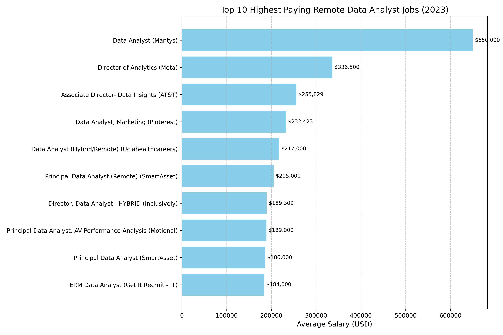
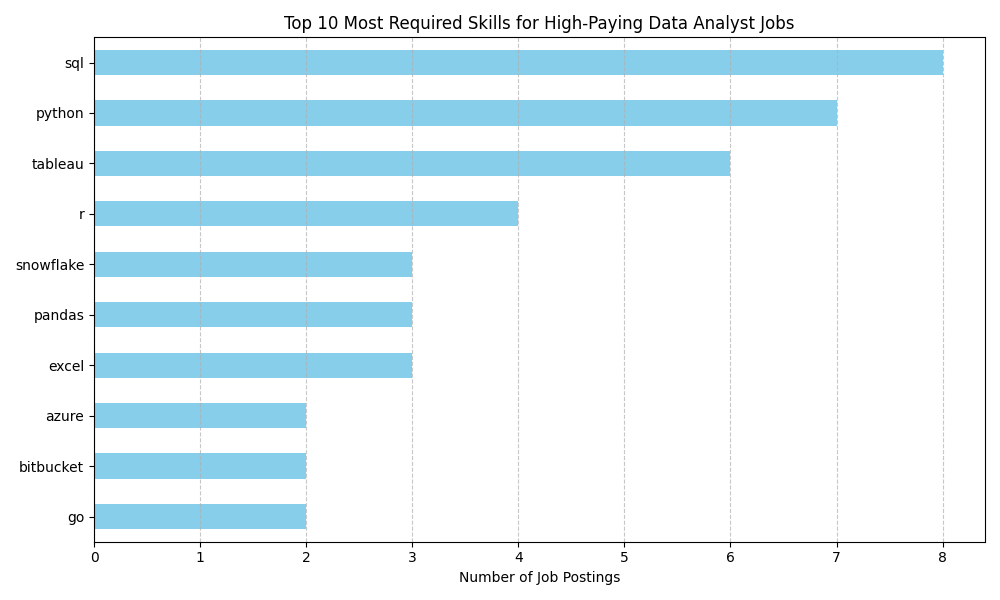
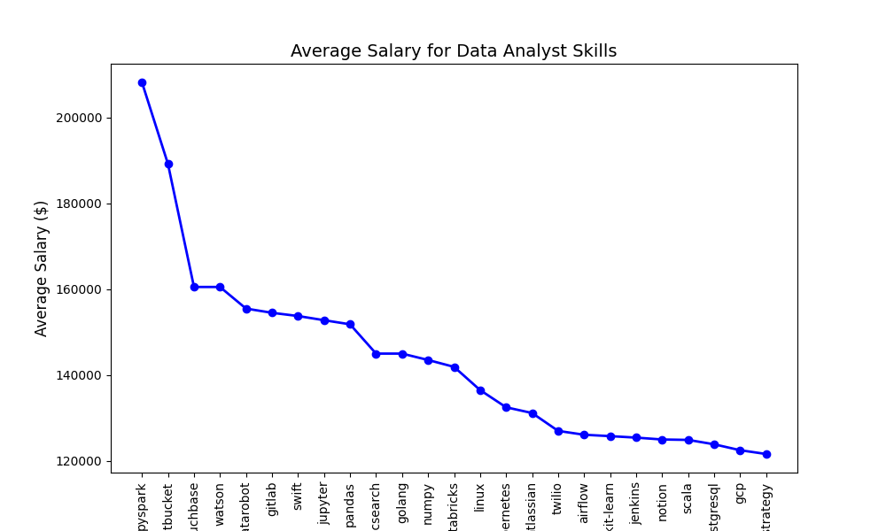

# Introduction

This project analyzes top-paying data analyst roles, highlights the most in-demand skills, and uncovers where high salaries and high demand align in the world of data analytics.

SQL queries? Check them out here: [project_sql folder](/project_sql/)

# Background

Born from a desire to better navigate the data analyst job market, this project focuses on identifying top-paying roles and high-demand skills — helping others streamline their job search for optimal opportunities.

This capstone project marks the final milestone of a course I followed by [Luke Barousse](https://www.youtube.com/watch?v=7mz73uXD9DA) on YouTube.

### The Questions Answered Through The SQL Queries Were:

    1.What are the top jobs for my role?
    2. What are the skills required for these top-paying roles?
    3.What are the most in-demand skills for my role?
    4.What are the top skills based on salary for my role?
    5.What are the most optimal skills to learn?

# Tools I Used

To explore the data analyst job market, I leveraged a range of tools:

-**SQL:** Used to write powerful queries and extract meaningful insights from the database.

-**PostgreSQL:** Selected as the database management system for its reliability in handling complex datasets.

-**Visual Studio Code:** My primary workspace for writing and executing SQL queries, as well as managing the database environment.

-**Git & GitHub:** Used for tracking changes, managing versions, and publishing my SQL scripts and project documentation.

# The Analysis

Each query in this project was designed to explore a specific angle of the data analyst job market. Here’s how I tackled each research question:

### 1.Top Paying Data Analyst Jobs

To find the highest-paying positions, I filtered data analyst job listings based on average yearly salary and location, with a special focus on remote opportunities. This query highlights some of the best-paying roles in the field.

```sql
SELECT
    job_id,
    job_title,
    job_location,
    job_schedule_type,
    salary_year_avg,
    job_posted_date,
    name AS company_name
FROM
    job_postings_fact
LEFT JOIN company_dim ON job_postings_fact.company_id = company_dim.company_id
WHERE
    job_title_short = 'Data Analyst' AND
    job_location = 'Anywhere' AND
    salary_year_avg IS NOT NULL
ORDER BY
    salary_year_avg DESC
LIMIT 10
```

**Top Data Analyst Job Insights (2023)**

Here’s a snapshot of the highest-paying data analyst roles:

**Wide Salary Range:** Salaries among the top 10 roles range from $184,000 to $650,000, highlighting the strong earning potential in the field.

**Diverse Employers:** Companies like SmartAsset, Meta, and AT&T are offering top salaries, reflecting high demand across multiple industries.

**Variety in Job Titles:** Roles span from Data Analyst to Director of Analytics, showing the broad range of specializations and career paths within data analytics.



### 2.Skills Required for Top-Paying Jobs

To dig deeper into the top-paying data analyst roles, I first identified the highest-paying remote jobs and then joined them with the specific skills required for each position. By combining job and skill data, I was able to see exactly which technical abilities are most sought after in high-paying roles.

```sql
WITH top_paying_jobs AS(

    SELECT
        job_id,
        job_title,
        salary_year_avg,
        job_posted_date,
        name AS company_name
    FROM
        job_postings_fact
    LEFT JOIN company_dim ON job_postings_fact.company_id = company_dim.company_id
    WHERE
        job_title_short = 'Data Analyst' AND
        job_location = 'Anywhere' AND
        salary_year_avg IS NOT NULL
    ORDER BY
        salary_year_avg DESC
    LIMIT 10
)

SELECT
    top_paying_jobs.*,
    skills
FROM top_paying_jobs
INNER JOIN skills_job_dim ON top_paying_jobs.job_id = skills_job_dim.job_id
INNER JOIN skills_dim ON skills_job_dim.skill_id = skills_dim.skill_id
ORDER BY
    salary_year_avg DESC
```

**Common Skills Across Roles**

**SQL**: Almost all positions list SQL as a required skill, highlighting its foundational importance for data analysts.

**Python**: This is another skill that frequently appears, especially for roles requiring more advanced data analysis, machine learning, or automation.

**Data Vizualization**: Tools like Tableau and Power BI are in high demand, along with Excel, which remains essential for most data-related tasks.

**Cloud & Big Data Technologies**: Skills such as AWS, Azure, Snowflake, and Databricks indicate that these companies value cloud expertise and big data tools.

**Other Key Tools**: Pandas, Jupyter, Git, and GitLab are also important for working with data and collaborating in software development or data projects.


### 3.In-Demand Skills

The goal is to identify the most in-demand skills specifically for data analyst positions, with a focus on remote work opportunities which helps determine which skills are currently the most sought after in remote data analyst job postings.

```sql
SELECT
    skills,
    COUNT(skills_job_dim.job_id) AS demand_count
FROM job_postings_fact
INNER JOIN skills_job_dim ON job_postings_fact.job_id = skills_job_dim.job_id
INNER JOIN skills_dim ON skills_job_dim.skill_id = skills_dim.skill_id
WHERE
    job_title_short = 'Data Analyst' AND
    job_work_from_home IS TRUE
GROUP BY
    skills
ORDER BY
    demand_count DESC
LIMIT 5
```

**The Top In-Demand Skills**

- SQL is the most sought-after skill.

- Excel and Python are also highly demanded.

- Tableau and Power BI are important for data visualization.

| Skill    | Demand Count |
| -------- | ------------ |
| SQL      | 7291         |
| Excel    | 4611         |
| Python   | 4330         |
| Tableau  | 3745         |
| Power BI | 2609         |

### 4. Top-Paying Skills

I'm aiming to identify the top skills that are associated with higher salaries for data analyst positions, particularly focusing on roles that offer specified salaries and work-from-home options. By calculating the average salary for each skill used in the job postings, I’m able to pinpoint which competencies are most valued by employers

```sql
SELECT
    skills,
   ROUND(AVG(salary_year_avg),0) AS avg_salary
FROM job_postings_fact
INNER JOIN skills_job_dim ON job_postings_fact.job_id = skills_job_dim.job_id
INNER JOIN skills_dim ON skills_job_dim.skill_id = skills_dim.skill_id
WHERE
    job_title_short = 'Data Analyst' AND
    salary_year_avg IS NOT NULL AND
    job_work_from_home = TRUE
GROUP BY
    skills
ORDER BY
    avg_salary DESC
LIMIT 25
```

**High-paying Skills**: The top-paying skills for data analysts are in Big Data, Cloud, and Machine Learning, with PySpark topping the list at an average salary of $208,172. Other high-paying skills include Bitbucket, Couchbase, and Watson, all of which have average salaries above $160,000.

**Programming and Engineering Skills**: Skills related to programming and engineering, such as Golang, Swift, and Scala, remain valuable with salaries around $145,000–$153,750, highlighting the demand for analysts who can work with advanced programming languages and engineering platforms.

**Core Data Tools** : While newer technologies are valued, foundational data analysis tools such as Jupyter, Pandas, NumPy, and PostgreSQL also continue to command strong salaries, with average salaries ranging from $125,000 to $151,000. This suggests that core technical skills remain essential in the data analyst role.



### 5.Optimal Skills

I aim to identify the most optimal skills to learn in order to secure a position as a data analyst. These skills should be both in high demand and high-paying, as determined previously.By running this query, I can identify which skills not only have high demand but also offer the highest average salaries, helping me focus on the most valuable skills for data analyst positions.

```sql
WITH skills_demand AS(
    SELECT
        skills_dim.skill_id,
        skills_dim.skills,
        COUNT(skills_job_dim.job_id) AS demand_count
    FROM job_postings_fact
    INNER JOIN skills_job_dim ON job_postings_fact.job_id = skills_job_dim.job_id
    INNER JOIN skills_dim ON skills_job_dim.skill_id = skills_dim.skill_id
    WHERE
        job_title_short = 'Data Analyst' AND
        salary_year_avg IS NOT NULL AND
        job_work_from_home IS TRUE
    GROUP BY
        skills_dim.skill_id


),

average_salary AS (
    SELECT
        skills_job_dim.skill_id,
        ROUND(AVG(salary_year_avg),0) AS avg_salary
    FROM job_postings_fact
    INNER JOIN skills_job_dim ON job_postings_fact.job_id = skills_job_dim.job_id
    INNER JOIN skills_dim ON skills_job_dim.skill_id = skills_dim.skill_id
    WHERE
        job_title_short = 'Data Analyst' AND
        salary_year_avg IS NOT NULL AND
        job_work_from_home = TRUE
    GROUP BY
        skills_job_dim.skill_id

)

SELECT
    skills_demand.skill_id,
    skills_demand.skills,
    demand_count,
    avg_salary
FROM
    skills_demand
INNER JOIN average_salary ON skills_demand.skill_id = average_salary.skill_id
WHERE
    demand_count > 10
ORDER BY
    avg_salary DESC,
    demand_count DESC
LIMIT 25
```

**Top High-Paying Skills**: Go, Confluence, and Hadoop offer strong salaries and demand.

**Cloud & Data Tools**: Skills in Snowflake, Azure, and AWS are in high demand, with salaries ranging from.

**Programming & Analytics**: Python and R are popular, along with data visualization tools like Tableau.

# What I Learned

During this project, I seriously leveled up my SQL game:

**Complex Query Crafting:** Became a pro at writing advanced SQL queries, seamlessly merging tables and using WITH clauses for smooth temporary table operations.

**Data Aggregation:** Mastered the use of GROUP BY, along with aggregate functions like COUNT() and AVG(), making data summarization second nature.

**Analytical Problem-Solving:** Enhanced my real-world analysis skills, transforming business questions into clear, actionable SQL queries packed with insights.

# Conclusion

### Insights

1.**Top-Paying Data Analyst Jobs**: Remote data analyst roles show a broad salary range, with the highest reaching an impressive $650,000.

2.**Skills for Top-Paying Jobs**: Top-paying data analyst roles demand strong SQL expertise, highlighting it as a key skill for securing higher salaries.

3.**Most In-Demand Skills**: SQL stands out as the most in-demand skill in the data analyst job market, making it essential for anyone pursuing a career in the field.

4.**Skills with Higher Salaries**: Specialized skills like SVN and Solidity are linked to the highest average salaries, highlighting the strong value placed on niche expertise.

5.**Optimal Skills for Job Market Value**: SQL dominates both in demand and salary potential, making it one of the smartest skills for data analysts to master in order to maximize their market value.

### Closing Thoughts

This project not only strengthened my SQL abilities but also offered valuable insights into the data analyst job market. The analysis acts as a roadmap for prioritizing skill development and focusing job search efforts. By targeting high-demand, high-paying skills, aspiring data analysts can better position themselves in a competitive market. This journey also emphasizes the importance of continuous learning and staying adaptable to emerging trends in the evolving field of data analytics.
